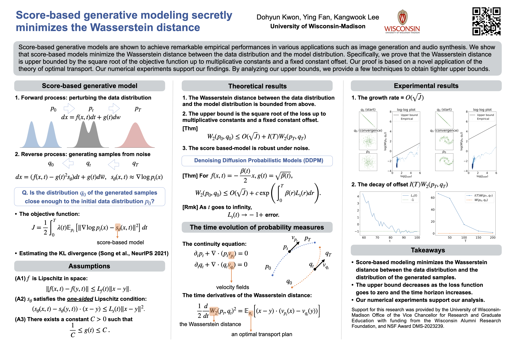

# Score-based Generative Modeling Secretly Minimizes the Wasserstein Distance
[Dohyun Kwon](https://sites.google.com/site/dhkwonmath/), [Ying Fan](https://pages.cs.wisc.edu/~yingfan/), [Kangwook Lee](https://kangwooklee.com/aboutme/).

Advances in Neural Information Processing Systems 35 (NeurIPS 2022).

Links: [Paper](https://openreview.net/forum?id=oPzICxVFqVM)

## Abstract
Score-based generative models are shown to achieve remarkable empirical performances in various applications such as image generation and audio synthesis. However, a theoretical understanding of score-based diffusion models is still incomplete. Recently, Song et al. showed that the training objective of score-based generative models is equivalent to minimizing the Kullback-Leibler divergence of the generated distribution from the data distribution. In this work, we show that score-based models also minimize the Wasserstein distance between them. Specifically, we prove that the Wasserstein distance is upper bounded by the square root of the objective function up to multiplicative constants and a fixed constant offset. Our proof is based on a novel application of the theory of optimal transport, which can be of independent interest to the society. Our numerical experiments support our findings. By analyzing our upper bounds, we provide a few techniques to obtain tighter upper bounds. 

## Experiments
Please see the ipynb file which contains the results for verifying the upper bound.
